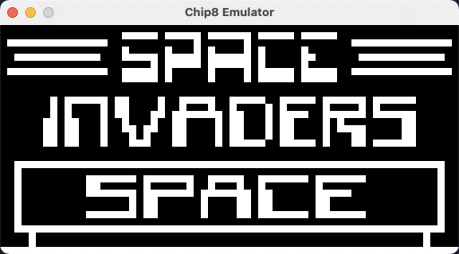
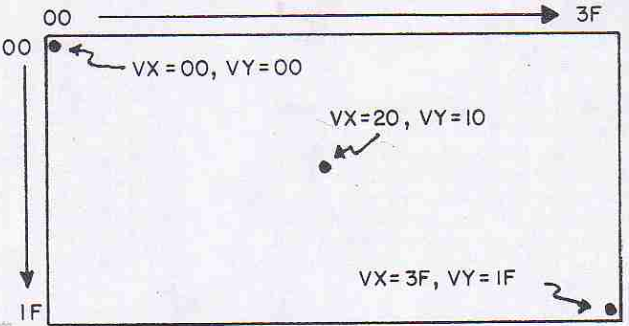

# Chip8 Emulator

Chip8 emulator implemented in Python 3.

It implements a COSMIC VIP with the original 36 instructions and with 4 KB of memory.

This documentation was built, mostly, from [Cowgod's documentation](http://devernay.free.fr/hacks/chip8).



## What is Chip-8?

From [Cowgod's website](http://devernay.free.fr/hacks/chip8/C8TECH10.HTM#1.0):

>Chip-8 is a simple, interpreted, programming language which was first used on some do-it-yourself computer systems in the late 1970s and early 1980s.
>The COSMAC VIP, DREAM 6800, and ETI 660 computers are a few examples. These computers typically were designed to use a television as a display,
>had between 1 and 4K of RAM, and used a 16-key hexadecimal keypad for input.
>The interpreter took up only 512 bytes of memory, and programs, which were entered into the computer in hexadecimal, were even smaller.
>
>In the early 1990s, the Chip-8 language was revived by a man named Andreas Gustafsson. He created a Chip-8 interpreter for the HP48 graphing calculator,
>called Chip-48. The HP48 was lacking a way to easily make fast games at the time, and Chip-8 was the answer.
>Chip-48 later begat Super Chip-48, a modification of Chip-48 which allowed higher resolution graphics, as well as other graphical enhancements.
>
>Chip-48 inspired a whole new crop of Chip-8 interpreters for various platforms, including MS-DOS, Windows 3.1, Amiga, HP48, MSX, Adam, and ColecoVision."

## Architecture

### CPU

The original implementation of the Chip-8 language includes [36 different instructions](https://github.com/mattmikolay/chip-8/wiki/CHIP%E2%80%908-Instruction-Set), including math, graphics, and flow control functions.

All instructions are 2 bytes long and are stored as most-significant-byte first (big-endian).
In memory, the first byte of each instruction should be located at an even addresses.
If a program includes sprite data, it should be padded so any instructions following it will be properly situated in RAM.

The crytal clock operates at 1.76 MHz.

### Memory

Chip-8 has a lot of registers, detailed [here](http://devernay.free.fr/hacks/chip8/C8TECH10.HTM#2.2):

The memory has the layout with big-endian.

* 16 general purpose 8-bit registers, referred to as `VX` where `X` is a hexadecimal digit (0 through F);
  * `VF` should not be used by any program, as it is also used as a flag by some instructions.
* 16-bit register called `I` used to store memory addresses in some instructions, so only the lowest (rightmost) 12 bits are usually used;
* two special 8-bit regsiters for the delay and sound timers:
  * when they are non-zero, they are automatically decremented at a rate of 60Hz.
* internal registers:
  * `PC`: 16-bit register used as program counter to store the currently executing address;
  * `SP`: 8-bit register used as stack pointer to point to the topmost level of the stack.
* stack is an array of 16 16-bit values used to store the address that the interpreter should return to when finished with a subroutine.


This [COSMIC VIP](https://github.com/Chromatophore/HP48-Superchip/blob/master/investigations/quirk_memlimit.md) implementation divides the memory as following:


* 512 bytes (0x000 a 0x1FF) são reservados para o interpretador Chip-8:
  * 0x000 a 0x080: fonts internas
  * 0x081 a 0x1FF: interpretador Chip-8 
* 3.232 bytes (0x200 a 0xE9F) podem ser utilizados para dados do programa
* 96 bytes (0xEA0 a 0xEFF) são reservados para stack e registradores:
  * 48 bytes (0xEA0 a 0xECF) são para stack
  * 32 bytes (0xED0 a 0xEEF) são para work area
  * 16 bytes (0xEF0 to 0xEFF): são para os registradores de dados (de `V0` até `VF`)
* 256 bytes (0xF00 a 0xFFF) são reservados para memória do display


* 0x00 to 0x1FF (512 bytes): reserved to Chip8 interpreter
  * 0x000 to 0x050: builtin fonts for hexadecimal digits (0 to F) of 5 bytes long (8x5 pixels)
  * 0x081 to 0x1FF: Chip8 implementation (here is empty, maybe I will put the actually code available [here](https://archive.org/details/bitsavers_rcacosmacCManual1978_6956559/page/n35/mode/2up)):
* 0x200 to 0xE9F (3,232 bytes): memory to program code
* 0xEA0 to 0xEFF (96 bytes): memory reserved internal user
  * 0xEA0 to 0xECF (48 bytes): stack
  * 0xED0 to 0xEEF (32 bytes): Chip-8 interpreter work area
  * 0xEF0 to 0xEFF (16 bytes): data registers (from `V0` to `VF`).
* 0xF00 to 0xFFF (256 bytes): reserved to display refresh.

```
'-' 0xFFF - end of memory
 |
 | (registers, stack and display area)
 |
'-' 0xEA0 - start of reserved area to internal use
 |
 |
 | (program code)
 |
 |
 |
'-' 0x200 - start of program memory (instructions and variables)
 |
 |  (reserved to Chip8 interpreter code)
 |
'-' 0x81 - interpreter reserved memory start
 |
'-' 0x00 - builtin font reserved memory start
```

### Display

The implementation can be created from [RCA COSMAC VIP CDP18S711 Instruction Manual](./docs/RCA%20COSMAC%20VIP%20CDP18S711%20Instruction%20Manual.pdf), page 13.

Chip-8 language used a 64x32 pixel monochrome display and it draws graphics on screen through the use of sprites.

A sprite is a group of bytes which are a binary representation of the desired picture.
Sprites may be up to 15 bytes (1 byte wide and at most 15 bytes high), for a possible sprite size of 8x15.

The sprite is positioned at screen with the format of MxN:

- M going from 0x0 to 0x3F
- N going from 0x0 to 0x1F



The pixels to be shown are defined in the last 256 bytes section of the RAM (from 0xF00 to 0xFFF).
The pixels are defined by each RAM position:

- 1 bit represents a white spot
- 0 bit represents a dark spot

Example of program to show the "8" pattern at the top left part of the screen:

> How to read: `<Opcode_Memory> <Opcode> <Comment>`
> - Memory: memory location at which the instruction bytes in the second column is stored
> - Opcode: Instruction opcode with its arguments

```
0200 A20A I=020A
0202 6100 V1=00
0204 6200 V2=00
0206 D125 SHOW 5MI@V1V2
0208 1208 GO 0208, keeps looping
020A F090 # sprite's line 1 and 2
020C F090 # sprite's line 3 and 4
020E F000 # sprite's line 5
```

In this project the implementation uses Pygame to render the screen memory map.
For each memory cell in the display is scaled to 4 pixels in Pygame screen.

### Keyboard

The keyboard input controller is implemented using Pygame event handling to capture the keys pressed by the player.

The implementation just map the key pressed to Chip8 input code using the following layout:

```
Original COSMIC VIP keyboard layout:

1 2 3 C
4 5 6 D
7 8 9 E
A 0 B F

Keyboard controller layout:

1 2 3 4
Q W E R
A S D F
Z X C V
```

## Sound

Chip8 uses a timer for sound to decide when it needs to make sound.
Everytime the ST register is non-zero the Chip8 buzz will sound. The sound has only one tone.

## Notes about COSMIC VIP implementation

* Instructions `8XY6` and `8XYE` use `VY`, see [here](https://github.com/Chromatophore/HP48-Superchip#8xy6--8xye-aka-x--y-x--y).

## TODO

* [x] CPU
    * [x] instructions
    * [x] Handle `SP`
    * [x] Handle `V0` to `VF`
    * [x] Handle `PC`
    * [x] Handle `I`
    * [x] Handle `DT`
    * [x] Handle `ST`
    * [x] Implement instruction decode
    * [x] Implement cycle
    * [x] Connect to main loop
* [x] Memory
    * [x] Memory: bultin fonts
    * [x] Memory: verify if needs to reserve memory for call stack and registers (`I`, `PC`, `SP`, `V0` to `VF`)
    * [x] Move logic to update register to `Cpu` class
* [x] Keyboard
    * [x] Implement hexadecimal controller
    * [x] Implement Pygame keyboard input controller
    * [x] Connect to main loop
    * [x] Halt only CPU in opcode FX0A (DT and ST is also halting)
    * [ ] Keyboard test showing ["not released"](https://github.com/Timendus/chip8-test-suite/?tab=readme-ov-file#3-fx0a-getkey)
* [x] Screen
    * [x] Implement display
    * [x] Implement rendering with Pygame
    * [x] Connect to main loop
* [x] Sound
* [x] Rom reader
* [x] Implement main loop
* [x] Implement separeted clocks for `DT` and `ST`
* [ ] Debug interface (?)

## Links

* [Wikipedia Chip-8](https://en.wikipedia.org/wiki/CHIP-8)
* [Wikipedia RCA 1802](https://en.wikipedia.org/wiki/RCA_1802)
* [Mastering Chip-8](http://mattmik.com/files/Chip-8/mastering/Chip-8.html)
* [Cowgod's Chip-8 Technical Reference](http://devernay.free.fr/hacks/Chip-8/C8TECH10.HTM#0.0)
* [Chip-8 Technical Reference](http://devernay.free.fr/hacks/Chip-8/C8TECH10.HTM#0.0)
* [Unified Chip-8 Documentation](https://github.com/trapexit/chip-8_documentation)
* [Doc with Interesting Comments](https://github.com/Chromatophore/HP48-Superchip)
* [Awesome Chip8 repo](https://github.com/tobiasvl/awesome-chip-8)
* Manual e old magazines:
  * [COSMAC VIP Instruction Manual](https://archive.org/details/bitsavers_rcacosmacCManual1978_6956559/page/n1/mode/2up)
  * [DREAM 6800 Manual](https://archive.org/stream/EA1979/EA%201979-05%20May#page/n85/mode/2up)
  * [Chip-8 Classic Manual](https://storage.googleapis.com/wzukusers/u$$ser-34724694/documents/5c83d6a5aec8eZ0cT194/CHIP-8%20Classic%20Manual%20Rev%201.3.pdf)
  * [Programming in Chip-8 - EIT ed Nov 1981](https://archive.org/stream/ETIA1981/ETI%201981-11%20November#page/n113/mode/2up)
* [Octo IDE - High level assembler for Chip-8 VM](https://github.com/JohnEarnest/Octo)
* [Guide to Making Chip-8 Emulator](https://tobiasvl.github.io/blog/write-a-chip-8-emulator/)
* [Chip-8 on the COSMAC VIP](https://www.laurencescotford.net/2020/07/25/chip-8-on-the-cosmac-vip-index/)
  * [Drawing Sprites](https://www.laurencescotford.net/2020/07/19/chip-8-on-the-cosmac-vip-drawing-sprites/)
  * [Keyboard Input](https://www.laurencescotford.net/2020/07/19/chip-8-on-the-cosmac-vip-keyboard-input/)
* Chip-8 programs:
  * [Chip 8 Test Suite](https://github.com/Timendus/chip8-test-suite/?tab=readme-ov-file)
    * has test to validate the correct implementation of 8XY6 and 8XYE
  * [Chip8 Online Emulator](https://chip8emu.com/)
    * this emulator has an [incorrect implementation of opcodes 8XY6 and 8XYE](https://github.com/mattmikolay/chip-8/wiki/CHIP%E2%80%908-Instruction-Set#notes)
    * 8XY6 is validating `Vx = Vx >> 1` instead of using `Vx = Vy >> 1`
    * 8XYE is validating `Vx = Vx << 1` instead of using `Vx = Vy << 1`
  * [Chip8 Test Rom](https://github.com/corax89/chip8-test-rom?tab=readme-ov-file)
    * the validation is using [incorrect implementation of opcodes 8XY6 and 8XYE](https://github.com/mattmikolay/chip-8/wiki/CHIP%E2%80%908-Instruction-Set#notes)
    * we can change the behavior of these opcodes to tests the others

